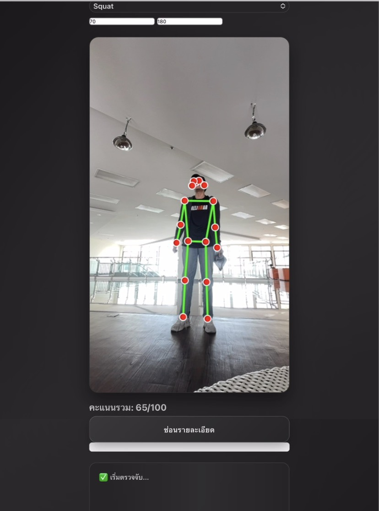
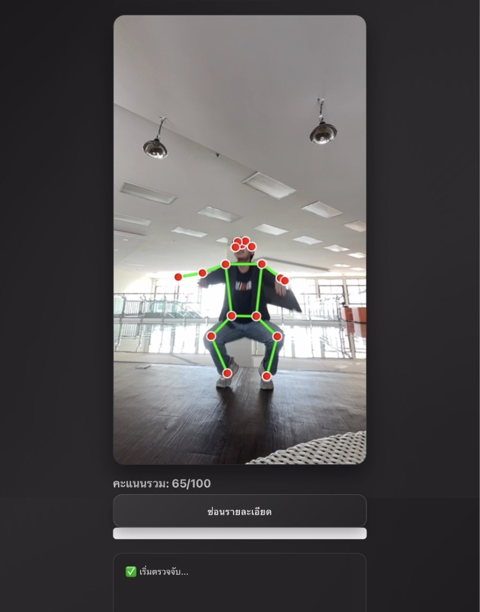
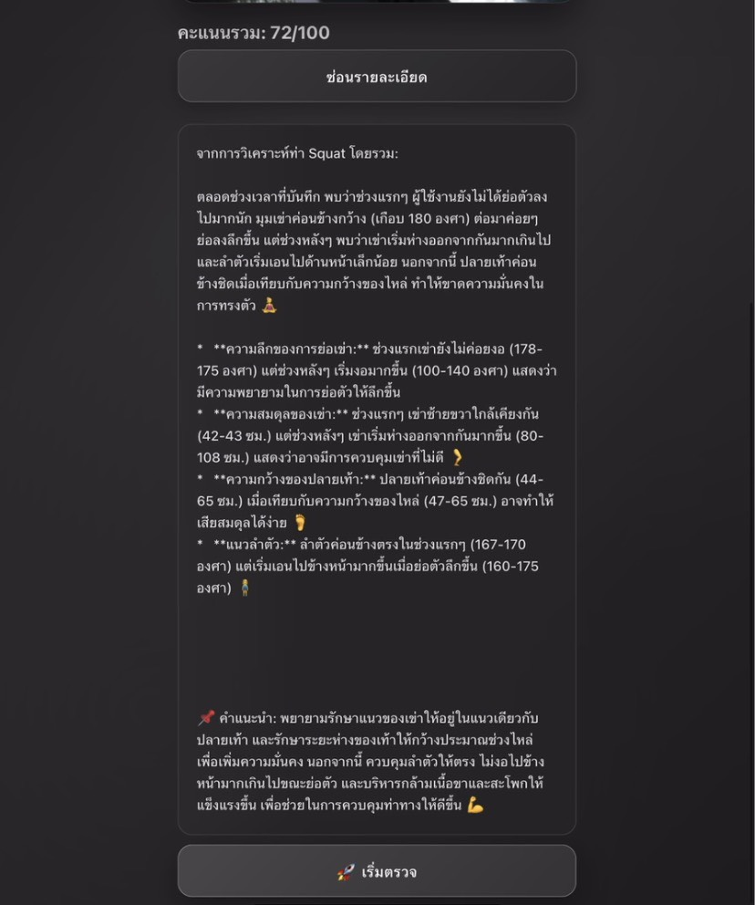

# 🏋️‍♀️ AI Exercise Posture Detection

> **ระบบตรวจจับและวิเคราะห์ท่าทางการออกกำลังกายด้วย AI** - ใช้ MediaPipe Pose Detection และ Google Gemini AI

# บางส่วนของระบบไม่สามารถเปิดเผยได้เนื่องจาก NDA
# 🌐 Production: https://app.allaline.com/

---

## 🎯 ภาพรวมโปรเจค

**AI Exercise Posture Detection** เป็นแอปพลิเคชันที่ใช้ **Computer Vision** และ **AI** ในการตรวจจับและวิเคราะห์ท่าทางการออกกำลังกาย เช่น **Squat, Push-up, Plank** เพื่อให้คำแนะนำแบบเรียลไทม์ช่วยให้ผู้ใช้ทำท่าได้ถูกต้องและปลอดภัย

### 🌟 จุดเด่น:
- ✅ **ตรวจจับท่าทางแบบเรียลไทม์** - ใช้ MediaPipe BlazePose
- ✅ **ให้คะแนนความถูกต้อง** - 0-100 คะแนน
- ✅ **คำแนะนำจาก AI** - Google Gemini วิเคราะห์และให้คำปรับปรุง
- ✅ **วัดมุมข้อต่อ** - แสดงมุมหัวเข่า สะโพก ไหล่
- ✅ **รองรับหลายท่า** - Squat, Push-up, Plank, และอื่นๆ
- 
[](https://www.python.org/)
[](https://reactjs.org/)
[](https://google.github.io/mediapipe/)
[](https://ai.google.dev/)

---

## 📱 Screenshots (ภาพหน้าจอการใช้งาน)

### 🔍 การตรวจจับท่าทาง Squat

<table>
  <tr>
    <td></td>
    <td></td>
  </tr>
  <tr>
    <td align="center"><b>การตรวจจับแบบเรียลไทม์</b><br/>แสดง Skeleton และ Keypoints<br/>คะแนน: 65/100</td>
    <td align="center"><b>แสดงมุมข้อต่อ</b><br/>มุมหัวเข่า: 70°, สะโพก: 180°<br/>วิเคราะห์ความลึกของท่า</td>
  </tr>
</table>

### 🤖 คำแนะนำจาก AI

<p align="center">
  
</p>

<p align="center"><b>Google Gemini AI วิเคราะห์และให้คำแนะนำ</b><br/>
คะแนน: 72/100 พร้อมข้อเสนอแนะในการปรับปรุงท่าทาง</p>

---

## 🎯 ฟีเจอร์หลัก

### 🔍 1. การตรวจจับท่าทางแบบเรียลไทม์
- **Skeleton Detection** - แสดงโครงร่างร่างกายด้วยจุดและเส้นเชื่อม
- **Keypoint Detection** - ตรวจจับจุดสำคัญ 33 จุด (หัว ไหล่ ข้อศอก มือ สะโพก เข่า ข้อเท้า)
- **Confidence Score** - แสดงระดับความมั่นใจของการตรวจจับ

### 📊 2. ระบบให้คะแนน (Scoring System)
- **0-100 คะแนน** - ประเมินความถูกต้องของท่าทาง
- **เกณฑ์การให้คะแนน:**
  - 90-100 🟢 ดีเยี่ยม (Excellent)
  - 70-89 🟡 ดี (Good)
  - 50-69 🟠 พอใช้ (Fair)
  - 0-49 🔴 ควรปรับปรุง (Needs Improvement)

### 🧠 3. AI Coaching (คำแนะนำจาก AI)
- **Google Gemini AI** - วิเคราะห์ท่าทางอย่างละเอียด
- **คำแนะนำเฉพาะบุคคล** - ให้ข้อเสนอแนะตามข้อบกพร่อง
- **ตัวชี้วัดหลัก:**
  - ✅ ความลึกของการย่อ (Depth)
  - ✅ ความสมดุลของเข่า (Knee Alignment)
  - ✅ ความกว้างของท่าขา (Stance Width)
  - ✅ แนวกระดูกสันหลัง (Spinal Alignment)

### 📐 4. การวัดมุมข้อต่อ
- **มุมหัวเข่า** - วัดมุมระหว่างต้นขาและน่อง
- **มุมสะโพก** - วัดมุมเอว
- **มุมไหล่** - สำหรับท่า Push-up
- แสดงค่าแบบเรียลไทม์ระหว่างการออกกำลังกาย

### 🎥 5. รองรับหลายท่า
- 🦵 **Squat** - ท่าย่อตัว
- 💪 **Push-up** - ท่าวิดพื้น
- 🧘 **Plank** - ท่าแพลงค์
- 🏃 ท่าอื่นๆ (สามารถเพิ่มได้)

---

## 🛠️ เทคโนโลยีที่ใช้

### 🎨 Frontend
| เทคโนโลยี | รายละเอียด |
|----------|-----------|
| **React** | UI Framework |
| **Vite** | Build Tool & Dev Server |
| **TensorFlow.js** | Machine Learning ใน Browser |
| **BlazePose (TFJS)** | Pose Detection Model |
| **HTML5 Canvas** | วาด Skeleton Overlay |
| **CSS3** | Styling |

### ⚙️ Backend
| เทคโนโลจี | รายละเอียด |
|----------|-----------|
| **Python 3.8+** | Programming Language |
| **Flask** | Web Framework & API |
| **MediaPipe Pose** | Google Pose Detection |
| **OpenCV** | Computer Vision |
| **Google Gemini AI** | AI Analysis & Feedback |
| **NumPy** | คำนวณมุมและตำแหน่ง |

---


## 📁 โครงสร้างโปรเจค

```
ai-exercise-posture-detection/
└── pose-coach-ai/
    ├── backend/                          # Flask Backend
    │   ├── app.py                        # Main API Server
    │   ├── requirements.txt              # Python Dependencies
    │   ├── utils/                        # Helper Functions
    │   │   ├── pose_detection.py         # MediaPipe Pose Logic
    │   │   ├── angle_calculation.py      # คำนวณมุมข้อต่อ
    │   │   └── gemini_ai.py              # Gemini AI Integration
    │   └── data/                         # Uploaded Files
    │       ├── poses/                    # Reference Poses
    │       └── videos/                   # Recorded Videos
    │
    ├── frontend/                         # React Frontend
    │   ├── src/
    │   │   ├── components/               # React Components
    │   │   │   ├── PoseDetector.jsx      # Main Pose Detection UI
    │   │   │   ├── Skeleton.jsx          # Skeleton Overlay
    │   │   │   └── FeedbackPanel.jsx     # AI Feedback Display
    │   │   ├── pages/                    # Pages
    │   │   │   ├── Home.jsx              # หน้าหลัก
    │   │   │   └── Exercise.jsx          # หน้าออกกำลังกาย
    │   │   ├── utils/                    # Utilities
    │   │   │   ├── blazepose.js          # BlazePose Setup
    │   │   │   └── api.js                # API Calls
    │   │   └── App.jsx                   # Main App
    │   ├── index.html
    │   ├── vite.config.js
    │   └── package.json
    │
    ├── docs/                             # Documentation
    │   ├── HOW-TO-ADD-SCREENSHOTS.md     # คำแนะนำเพิ่มรูป
    │   └── screenshots/                  # ภาพหน้าจอ
    │       ├── 01-squat-detection.png
    │       ├── 02-ai-feedback.png
    │       └── 03-angle-display.png
    │
    ├── start.bat                         # 🚀 Start Script (Windows)
    ├── stop.bat                          # 🛑 Stop Script (Windows)
    └── README.md                         # เอกสารหลัก
```

---

## 🔌 API Documentation

### 🔗 Endpoints

#### 1. **POST** `/api/analyze-pose`
วิเคราะห์ท่าทางจากรูปภาพ

**Request Body:**
```json
{
  "image": "base64_encoded_image",
  "exercise_type": "squat"
}
```

**Response:**
```json
{
  "score": 72,
  "keypoints": [...],
  "angles": {
    "knee_left": 70,
    "knee_right": 72,
    "hip_left": 180,
    "hip_right": 180
  },
  "feedback": "คำแนะนำจาก AI..."
}
```

#### 2. **POST** `/api/get-ai-feedback`
ขอคำแนะนำจาก Google Gemini AI

**Request Body:**
```json
{
  "pose_data": {...},
  "exercise_type": "squat"
}
```

**Response:**
```json
{
  "feedback": "ข้อเสนอแนะจาก AI...",
  "tips": ["tip1", "tip2", "tip3"]
}
```

---


## 📄 License

ใช้สำหรับการศึกษาและพัฒนาเท่านั้น

## 📚 เอกสารอ้างอิง

- [MediaPipe Pose Documentation](https://google.github.io/mediapipe/solutions/pose.html)
- [Google Gemini AI](https://ai.google.dev/)
- [TensorFlow.js Pose Detection](https://www.npmjs.com/package/@tensorflow-models/pose-detection)
- [BlazePose Paper](https://arxiv.org/abs/2006.10204)


